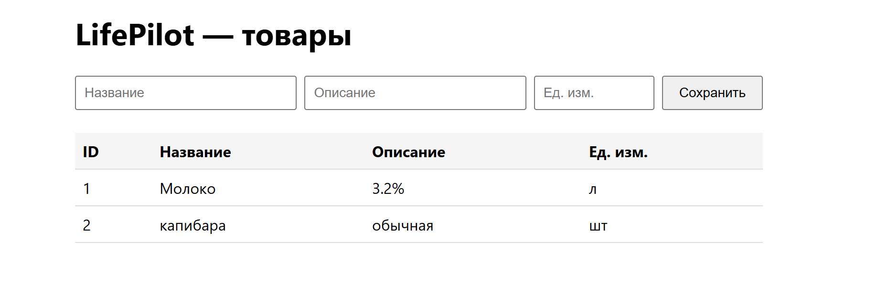

# Лаба 0 (DevOps) — свой сервис

## Задание

Собрать приложение из трёх частей: бэкенд, фронтенд и база данных как отдельный сетевой сервис. Бэкенд должен уметь писать в базу и читать из неё. Фронт должен ходить в бэкенд и показывать данные. Главная проверка — сохранить что-то через форму, перезагрузить страницу и убедиться, что запись осталась. В README описать, как всё это запустить, и приложить скрин работающего приложения.

## Ход работы

### Выбор технологий

Начал я, как любой уважающий себя студент, с поиска максимально удобного пути. У меня в этом семестре параллельно идут БД и сетевые технологии, и по каждой надо делать свою лабу. Сидеть и пилить два разных проекта мне было откровенно лень. Плюс была мысль, что в следующем семестре нужно будет что-то делать для практики, и неплохо бы уже сейчас начать проект, который потом пригодится.

И тут я такой: «А что если сделать один проект и сдать его сразу по двум предметам вместо лаб?» Ведь в этом семе у нас C# и PostgreSQL — почему бы и нет. Так и родился **LifePilot** — система учёта личных расходов и анализа цен. Технологии определились сами собой:

- **Backend**: ASP.NET Core (Minimal API) — потому что C# в семестре.
- **Frontend**: HTML + JS — потому что знаком и не надо тащить React ради формы.
- **БД**: PostgreSQL в Docker — потому что лаба требует отдельный сетевой сервис, а не встроенный SQLite.
- **Взаимодействие**: HTTP / REST.

### Создание проекта

Дальше надо было строить архитектуру. И вот тут я честно скажу: писать всё с нуля руками мне было лень, поэтому я пошёл к Дипсику и попросил накидать базовый скелет — `Program.cs` с двумя эндпоинтами, `docker-compose.yml` для БД, `init.sql` с таблицей `products`, простенький фронт с формой и таблицей.

Дипсик справился, но не до конца. Он зачем-то вынес Docker и бэкенд за пределы проекта, пришлось исправлять косяки. Дальше всё шло гладко, пока я не наткнулся на первую серьёзную проблему.

### Подготовка окружения и запуск Docker

Прежде чем что-то запускать, надо поставить и поднять сам Docker. У меня Windows, поэтому путь такой:

1. **Установка Docker Desktop.** Скачивается с официального сайта `docker.com/products/docker-desktop`. При установке важно оставить галочку **Use WSL 2 instead of Hyper-V** — Docker Desktop на Windows работает именно через WSL2.
2. **WSL2.** Если WSL не установлен, Docker Desktop сам предложит его поставить, либо можно сделать это руками из PowerShell от имени администратора:
   ```powershell
   wsl --install
   ```
   После этого — обязательная перезагрузка компьютера.
3. **Запуск Docker Desktop.** После перезагрузки открываю **Docker Desktop** из меню «Пуск». Жду, пока иконка кита в трее станет **зелёной** — это значит, что движок запущен и можно работать. Пока иконка серая или анимированная — команды `docker` в консоли будут падать с ошибкой вида `npipe:////./pipe/dockerDesktopLinuxEngine: The system cannot find the file specified`.
4. **Проверка.** Открываю **новый** PowerShell (важно — новый, чтобы подхватился PATH после установки) и выполняю:
   ```powershell
   docker --version
   docker compose version
   docker run hello-world
   ```
   Если `hello-world` вывел приветствие — Docker готов к работе.

### Откуда запускать команды

Отдельно проговорю, потому что сам на этом спотыкался. У проекта есть **корень** — папка `life-pilot`, где лежит `docker-compose.yml`. Дальше всё строго по правилу:

| Что | Где запускать | Команда |
|:---|:---|:---|
| БД (PostgreSQL) | `life-pilot` (там, где `docker-compose.yml`) | `docker compose up -d db` |
| Логи БД | `life-pilot` | `docker compose logs db` |
| Backend | `life-pilot/backend/LifePilot.Api` (там, где `.csproj`) | `dotnet run` |
| Запросы к API | любая папка | `curl.exe http://localhost:5075/api/products` |
| SQL внутри контейнера | любая папка | `docker exec -it lifepilot-db psql -U lifepilot -d lifepilot` |

`docker compose` **нельзя** запускать из произвольной папки — он ищет `docker-compose.yml` в текущей директории. Если запустить из корня `DevOps-3sem`, а `docker-compose.yml` лежит внутри `life-pilot`, Docker создаст «пустой» проект или подхватит чужой. У меня так один раз и получилось: контейнер создался из одной папки, потом я запустил compose из другой, и Docker начал ругаться на конфликт имён контейнеров.

Также важно: `dotnet run` держит терминал занятым, пока работает сервер. Поэтому у меня открыто **три окна PowerShell** — одно под БД (там, где нужно, смотреть логи), одно под бэкенд, одно под `curl` и работу с БД.

### Проблема с портами, или Postgres против Docker

Я, как порядочный человек, поднял контейнер с PostgreSQL через `docker compose up -d db`, написал бэкенд, запустил. И получил ошибку:

```
Npgsql.PostgresException: 28P01: password authentication failed for user "lifepilot"
```

Первый раз — ну, бывает. Поменял пароль. Второй раз — то же самое. Снёс volume, пересоздал контейнер, проверил всё трижды. Бэкенд всё равно падал с тем же `28P01`.

Я уже начал подозревать, что дело в WSL, в Docker Desktop. Снёс том, пересоздал, сменил пароль, проверил внутри контейнера через `psql` — всё работает, пароль принимается. А бэкенд всё равно падает.

И тут меня осенило: а что если бэкенд подключается вообще не туда, куда я думаю?

Полез в `netstat -ano | findstr :5432` и увидел:

```
TCP    0.0.0.0:5432    LISTENING    6124
TCP    0.0.0.0:5432    LISTENING    9492
```

**Два процесса на одном порту.** Один — `postgres.exe`, локальный PostgreSQL, который я ставил ещё до Docker. Второй — `com.docker.backend`, прокси Docker Desktop. И когда бэкенд стучался на `localhost:5432`, Windows отдавал запрос непонятно кому, чаще всего — локальному Postgres, у которого пароль был, конечно же, другой.

Вот и вся магия. Пароль в конфиге был правильный, БД работала, а бэкенд просто кричал в закрытую дверь соседнего сервера.

Решение оказалось скучным до безобразия: переехать на порт `5433`. В `docker-compose.yml` прописал `5433:5432` (снаружи 5433, внутри стандартный 5432), в `appsettings.json` — `Host=127.0.0.1;Port=5433`. Перезапустил контейнер, перезапустил бэкенд — и оно заработало.

### Финальная проверка

После переезда на `5433` всё завелось:

- Бэкенд отдал `[]` на `GET /api/products`.
- `POST` вернул `{"id":1}`, добавив «Молоко».
- `GET` показал `[{"id":1,"name":"Молоко","description":"3.2%","unit":"л"}]`.
- В БД через `psql` строка тоже была на месте.
- Фронт открылся, форма работает, данные сохраняются, после перезагрузки страницы — не пропадают.

Всё, Lab 0 закрыт.

## Вывод

В ходе лабы был собран минимальный LifePilot: ASP.NET Core API, HTML-фронт и PostgreSQL в Docker. Главная боль оказалась не в коде, а в инфраструктуре: локальный Postgres и Docker не поделили порт `5432`, и пришлось переехать на `5433`.  Железное правило : перед тем как поднимать сервис на порту, надо проверить `netstat`. Мораль: не всегда баг там, где ты его ищешь. Иногда он сидит в соседней службе, о которой ты давно забыл.